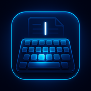
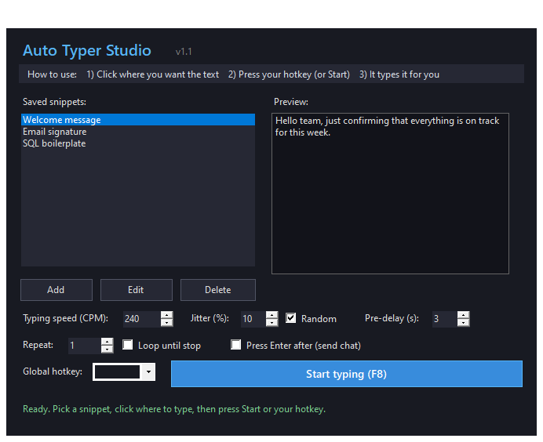

# Auto Typer Studio

*Lightweight Windows utility for automated text input and repeatable keyboard sequences.*

---

## What it does

Auto Typer Studio types text sequences and repeats keyboard actions on a schedule or hotkey. Free, no ads, no telemetry.

  

## ✨ Features

- **Snippet library** — save unlimited text snippets (welcome messages, email signatures, boilerplate)
- **Hotkey triggering** — bind `F8` (or any key) to start/stop typing
- **Speed + jitter** — CPM control with human-like randomization
- **Loop mode** — repeat N times or continuously until stopped
- **Pre-delay** — countdown before typing starts (switch to target window)
- **Send Enter** — auto-press Enter after each snippet (chat / form flows)
- **Live preview** — see exactly what will be typed before you fire

## 🚀 Quick Start

1. Download `AutoTyperStudio.zip` from the [Releases](https://github.com/poorpint/auto-typer-studio/releases/latest) page.
2. Extract the archive.
3. Run `AutoTyperStudio.msi` to install (adds to Start Menu, uninstalls cleanly).
4. Launch **Auto Typer Studio**, add your first snippet, click **Start typing (F8)**.

## 💡 Use Cases

- **Chat + support** — canned replies, meeting confirmations, standup updates
- **Development** — repeat SQL boilerplate, imports, license headers into any editor
- **QA testing** — populate forms with test data across many pages
- **Roleplay + streaming** — trigger scripted phrases via hotkey without alt-tabbing

## ❓ FAQ

**Is it really free?**
Yes. No paid tier, no ads, no premium unlocks.

**Does it work in games?**
It sends OS-level keyboard input, so most games accept it. Some anti-cheat systems (Vanguard, Easy Anti-Cheat) may flag automation tools — use at your own risk.

**Windows 7 / macOS / Linux?**
Windows 10 and 11 only right now. No plans for other platforms.
